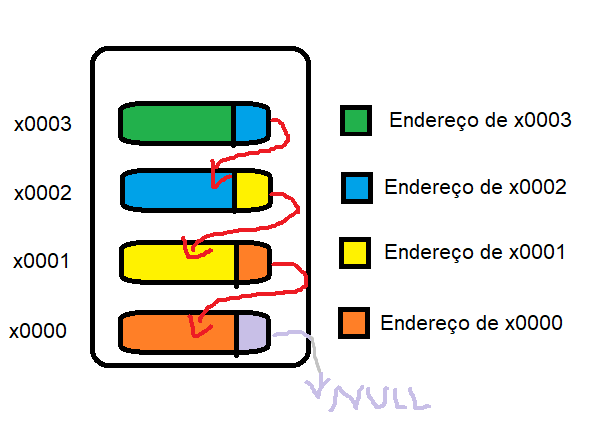
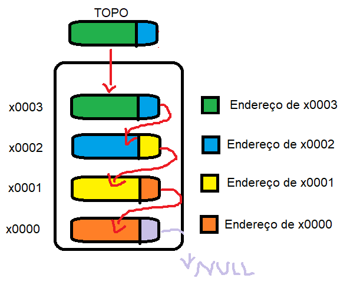
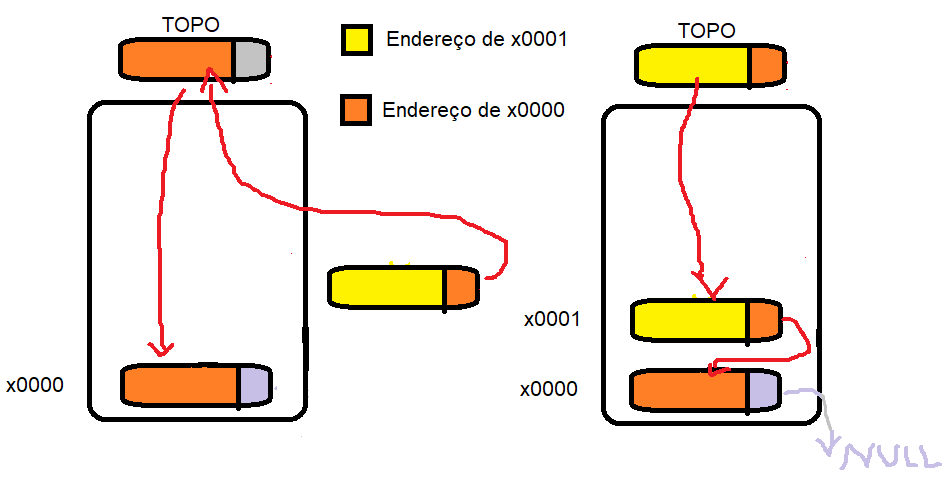
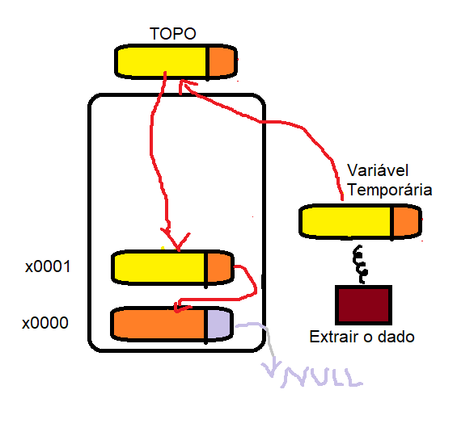
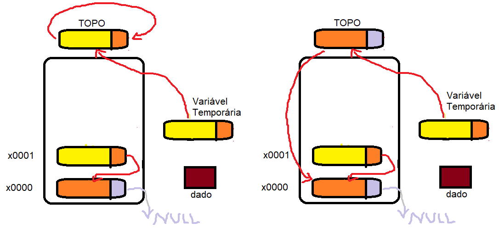
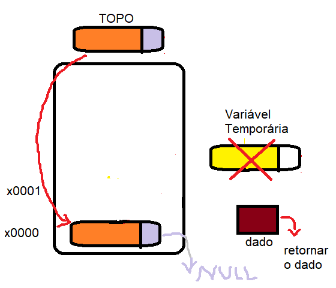

# pilhaImplementacao

Esse repositório tem como objetivo explorar a construção e implementação da estrutura de dados pilha.

## 1.1 - O que é uma pilha?

No contexto do dia a dia uma pilha seria um conjunto de itens um sobre o outro, no qual você insere um novo item sempre no topo e caso queira retira algo recomenda-se remover a partir também do topo. Existem casos em que há a necessidade de remover itens que não estão na parte de cima da pilha, e são nesses casos que recorrentemente na presa (ou na preguiça) ocorrem acidentes, ao tentar remover um item da pilha sem retirar os de cima a pilha acaba se desfazendo, por exemplo, aquela pilha de roupas dobradas dentro do guarda-roupas no início da semana e que no final da semana não é mais nem uma pilha nem um conjunto de roupas dobradas (ou quase isso).

## 1.2 - E na computação?

Em vários cenários, situações do cotidiano precisam também ser representados na computação, o que é caso da pilha. A pilha é uma forma de estruturar dados de maneira a abstrair o comportamento de uma pilha real (sem os acidentes), ou seja, um conjunto de dados organizados na memória (nosso "guarda-roupas") que possuem funcionalidades atrelados a ele e que permitem manipulá-los como uma pilha, inserir no topo, remover do topo. 

## 2.1 - Implementação

Para implementar a pilha primeiro precisamos entender o algoritmo utilizado para construí-la. Existem diversas formas de fazer uma pilha, entretanto, para esse caso vamos construir uma pilha que seja dinâmica.

### 2.2 - Algoritmo

O algoritmo de uma pilha dinâmica se centra no comportamento de remover e adicionar elementos do topo e como ela é dinâmica trabalharemos com ponteiros. Antes de iniciar precisamos entender que em uma pilha dinâmica a ligações entre os elementos são feitas atráves de ponteiros, em que um item aponta para um proximo **(nesse caso "abaixo")** e esse por seguinte também aponta para o próximo e assim por diante até a base da pilha em que o próximo item será nulo (NULL) sendo uma referência para o fim da pilha. 

Além disso, teremos um ponteiro específico que irá guardar o endereço do elemento do topo da pilha, assim dando uma referência de inicio para a pilha.

- ### Criando a pilha
    Ao iniciar a pilha é necessário armazenarmos espaço na mémoria pra ela, e logo após, como a pilha está vazia, setar seu topo para Nulo (NULL).

    

- ### Inserir elemento na pilha (Push)
    Para inserir um novo elemento **A** na pilha precisamos primeiro alocar esse elemento na mémoria. Com o elemento alocado, faremos com que o ponteiro para o proximo elemento de A aponte para o topo da pilha, isso irá criar uma coneção entre os elementos da pilha e novo elemento, lembrando que se a pilha estiver vazia a consequência será que o próximo elemento do primeiro elemento será Nulo (NULL).

    

    Logo após fazer a conexão entre o elemento A e a pilha, precisamos mudar a referência do topo fazendo com que o ponteiro topo aponte para o novo elemento, como mostrado acima. 

- ### Remover elemento da pilha (Pop)
    Para remover um elemento **B** da pilha, precisamos primeiro lembrar que na pilha o último a entrar é o primeiro a sair, ou seja, temos que retirar do topo. O primeiro passo é armazenar em um várivel temporária a referência para o elemento a ser removido do topo da pilha e extrair para uma outra váriavel o dado que está dentro do elemento a ser removido.

    

    O próximo passo a fazer é mudar a referência do topo, como o item a ser removido não estará mais na pilha, o topo tem que apontar para o elemento "abaixo". Para isso, temos que fazer com que o topo aponte para o seu próximo, isso porque o topo possui o endereço do elemento a ser removido e próximo desse elemento a ser removido é justamente o item "abaixo" na pilha.

    

    Por fim, agora podemos liberar o espaço de memória do antigo topo, então liberamos a variável temporária aponta para o antigo topo. Além disso, devemos retornar o dado armazenado do antigo topo, já que a função pop retorna o dado removido.

    
    
    - ### Liberar Pilha
        A pilha por ser dinâmica exige um processo de alocação de mémoria por pedido explícito do desenvolvedor, logo, é importante se certificar se o espaço alocado será ou não utilizado após a execução, nesse caso é necessário uma funcionalidade da pilha que libera da mémoria a estrutura pilha e todos os itens dela. Para isso, é preciso percorrer toda pilha com uma variável auxiliar e ir liberando item por item até achar a base da pilha (NULL) e no final desalocar/liberar a própria pilha.

## ✒️ Autor

* [**Ezequias Kluyvert**](https://github.com/UserZeca) 😊